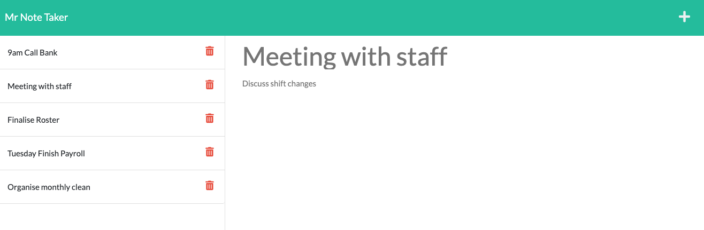
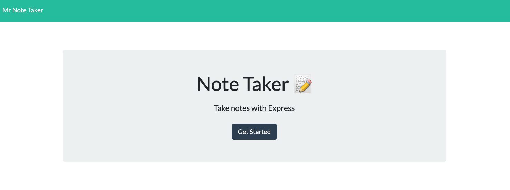

# Mr Note Taker

> Note Taker that can be used to write and save notes using Express.js.
> Live Demo [_here_](https://example.com).

## Table of Contents

- [General Info](#general-information)
- [Technologies Used](#technologies-used)
- [Features](#features)
- [Screenshots](#screenshots)
- [Setup](#setup)
- [Usage](#usage)
- [Contact](#contact)
- [License](#license)

## General Information

A simple note taker to keep track of your appointments, daily/weekly tasks and notes.

## Technologies Used

- HTML5
- CSS3
- JavaScript
- Node.js
- Express.js
- [Boostrap v5.1](https://getbootstrap.com/docs/5.1/getting-started/introduction/)
- [FontAwesome](https://fontawesome.com/)

## Features

- Save notes to keep track of appointments and daily/weekly tasks.
- Delete tasks when they have been completed.

## Screenshots




## Setup

After cloning the repository, run the following command from the root of the project:

```
npm install
```

## Usage

Enter the following into the command line to start local server.

```
node server.js
```

## Contact

Created by [@lilyso](https://github.com/lilyso/) - feel free to contact me!

## License

This project is open source and available under the [MIT License](https://opensource.org/licenses/MIT).
